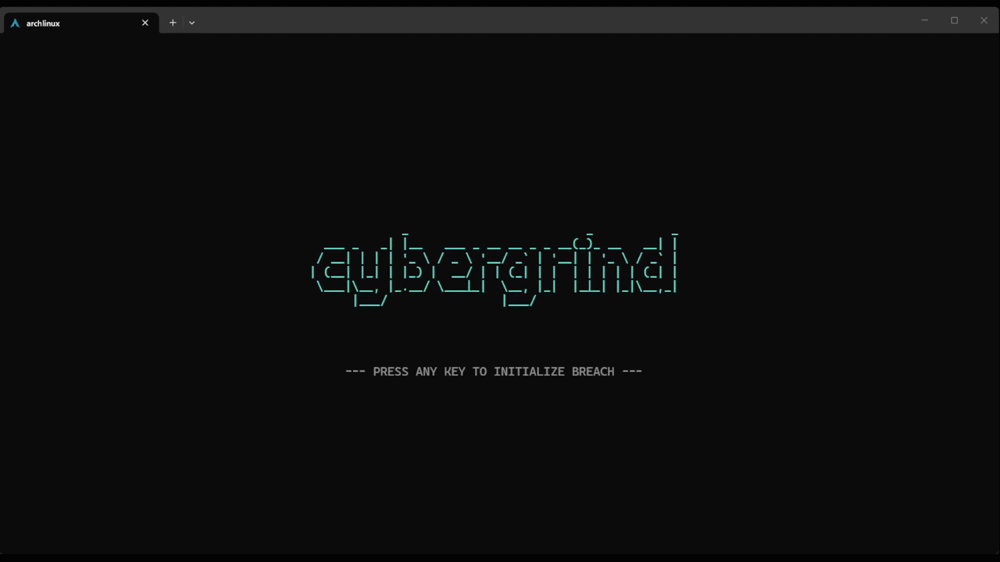

# whiletrue


<!--  -->


`whiletrue` or `Cybergrind` is a cyberpunk-themed terminal idle game, that you can run on the side while working. Made for my ADHD-self initially.



## Features

- **Pretty damn retro**: A retro-styled UI with dedicated windows for system status, terminal logs, and the black market.
- **Somewhat addicting**: Start by manually breaching (pressing space) and work your way up to.. no....
- **Persistent progress**: Your progress is automatically saved every 30 seconds and upon exiting the game, in the folder where you ran the build from. (save_data.json)

## Requirements

- **C++23 Compiler** (e.g., `g++ 12+`)
- **ncurses library**
- **pthread library**

## Building and Running

### Build

To compile the project and create the executable in the `build/` directory:

```bash
make
```

### Run

To build and launch the game immediately:

```bash
make run
```

### Clean

To remove build artifacts:

```bash
make clean
```

## Controls

| Key | Action |
|-----|--------|
| `Space` | Manually breach (Generate DATA) |
| `Up, Down arrow keys to select, then ENTER` | Purchase Quickhacks (Buildings) |
| `b` | Purchase Overclock Multiplier |
| `c` | Purchase DATA/SEC click share |
| `g` | Intercept Anomalous Signal (Golden Cache/Cookie) |
| `s` | Manual Save |
| `l` | Manual Load |
| `q` or `Esc` | Save and Quit |

## License

This project is licensed under the Apache License 2.0. See the [LICENSE](LICENSE) file for details.
